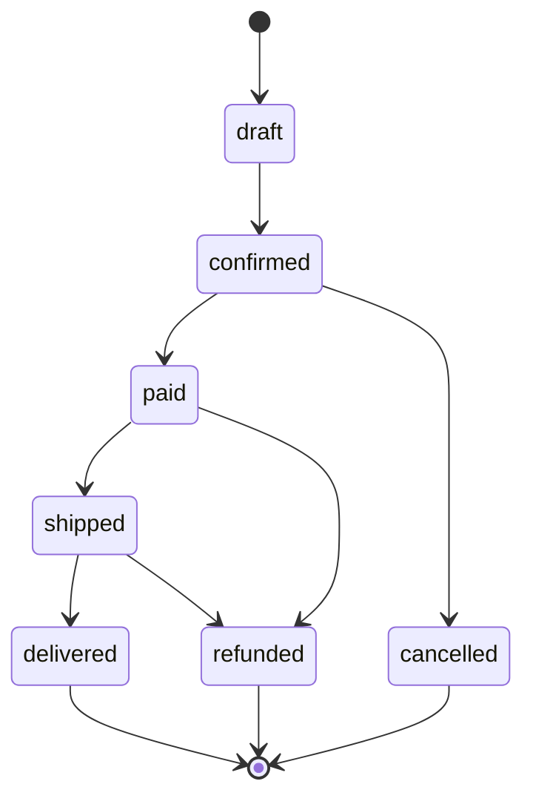

# ARIA Language Reference

**ARIA** (AI-Readable Intent Architecture) is a formal specification language where humans write contracts (the WHAT) and AI generates code (the HOW). This document is the complete language reference.

---

## Table of Contents

1. [Overview](#overview)
2. [File Structure & Metadata](#file-structure--metadata)
3. [Type System](#type-system)
4. [Contracts](#contracts)
5. [Behaviors](#behaviors)
6. [Composition](#composition)
7. [Built-in Operators & Functions](#built-in-operators--functions)
8. [Comments](#comments)
9. [Compilation Targets](#compilation-targets)
10. [CLI Commands](#cli-commands)

---

## Overview

### Philosophy

ARIA is designed around these core principles:

| Principle | Rationale |
|-----------|-----------|
| **ASCII-only, zero math symbols** | AI tokenizes ASCII better than Unicode symbols; no `∀`, `∃`, `◻`, `◇` |
| **Contracts as native primitives** | Pre/post/invariant pattern proven over 40 years (Dafny, Eiffel, Ada SPARK) |
| **Examples are mandatory** | AI generates 85% better code with concrete examples (Gherkin-inspired) |
| **Each line parseable without context** | Reduces AI hallucinations by 50%+ (inspired by Klar) |
| **Compilation to existing languages** | TypeScript, Rust, Python—no proprietary ecosystem |
| **Refinement types, not dependent types** | Power of verification without academic complexity (Liquid Haskell model) |
| **Automatic visualization** | Specifications generate Mermaid diagrams natively |

### What ARIA Is NOT

- **Not a programming language**: No mutable variables, loops, or imperative control flow
- **Not a theorem prover**: No proof tactics like Lean; no exhaustive model checking like TLA+
- **Not pseudo-code**: Formally verifiable with SMT solvers and compilable to production code

### What ARIA IS

A language of **executable contracts** that:
1. Describes types, constraints, and expected behaviors
2. Compiles to validation schemas (Zod, Pydantic, etc.)
3. Projects to visual diagrams (Mermaid)
4. Guides AI to generate verified code in any target language

---

## File Structure & Metadata

### Module Declaration

Every `.aria` file is a module with metadata:

```aria
-- Simple single-line comment
--- Documentation comment (included in generated output)

module PaymentProcessing
  version "1.0"
  target typescript, rust
  author "Jonathan"
```

**Keywords:**
- `module` — Namespace and compilation unit
- `version` — Semantic version string
- `target` — Comma-separated list of compile targets (typescript, rust, python)
- `author` — Author name (optional, for documentation)

**File naming convention:** `<module-name>.aria`

### Module-Level Metadata

```aria
module Marketplace
  version "2.1"
  target typescript
  author "Jonathan"
  description "Commission calculation and artist payouts"
```

---

## Type System

### Primitives with Refinement

Types are primitives enhanced with constraints using `where` clauses:

```aria
type Money is Integer
  where self > 0
  where self <= 1_000_000
  unit "cents"

type Email is String
  where self matches /^[^@]+@[^@]+\.[^@]+$/
  where length(self) <= 255

type AccountId is String
  where length(self) == 26
  where self starts_with "acc_"

type Percentage is Integer
  where self >= 0
  where self <= 100
  unit "%"

type Url is String
  where self starts_with "http"
  where length(self) <= 2048

type PhoneNumber is String
  where self matches /^\+?[0-9\-\(\) ]{10,}$/
```

**Primitive base types:**
- `Integer` — 64-bit signed integer
- `String` — Unicode string
- `Boolean` — true or false
- `DateTime` — ISO 8601 timestamp
- `Decimal` — Arbitrary-precision decimal (for financial calculations)

**Refinement syntax:**
- `where CONDITION` — Constraint that must always be true for values of this type
- `self` — Refers to the value being constrained (not `$`, not `this`)
- `unit "..."` — Semantic annotation (documentation only, not enforced)

### Records

Structured types with named fields:

```aria
type Account is Record
  id: AccountId
  email: Email
  balance: Money
  status: AccountStatus
  created_at: DateTime

type Transaction is Record
  from_id: AccountId
  to_id: AccountId
  amount: Money
  timestamp: DateTime
  description: String
```

**Syntax:**
- Field names are identifiers (lowercase, underscores)
- Type annotation after colon
- No comma separators; whitespace is delimiter
- Can nest record types (flattening not required)

### Enumerations

Named variants with optional documentation:

```aria
type AccountStatus is Enum
  active    --- Account is operational
  frozen    --- Frozen by support (pending review)
  closed    --- Permanently closed

type OrderState is Enum
  draft     --- Panier en cours
  confirmed --- Order validated
  paid      --- Payment received
  shipped   --- Dispatched
  delivered --- Received by customer
  cancelled --- Cancelled before shipment
  refunded  --- Money refunded

type PaymentMethod is Enum
  credit_card
  bank_transfer
  paypal
  apple_pay
  google_pay
```

**Syntax:**
- `is Enum` — Declares enumeration
- One variant per line
- Optional `---` documentation comment after variant name
- No associated values (plain enums only)

### Lists

Typed collections with constraints:

```aria
type AccountList is List of Account
  where length(self) >= 0
  where length(self) <= 10_000

type ItemQuantities is List of Integer
  where length(self) > 0
  where every item >= 0

type Tags is List of String
  where length(self) <= 50
```

**Syntax:**
- `is List of TYPE` — Collection of elements
- Optional `where` clauses for length/cardinality constraints
- `length(self)` — Cardinality check
- `every item CONDITION` — All elements must satisfy condition

---

## Contracts

Contracts describe expected behavior: inputs, preconditions, postconditions, failure cases, and examples.

### Basic Contract Structure

```aria
contract TransferFunds
  --- Transfers funds from one account to another

  inputs
    from: Account
    to: Account
    amount: Money

  requires
    from.status == active
    to.status == active
    from.id != to.id
    from.balance >= amount

  ensures
    from.balance == old(from.balance) - amount
    to.balance == old(to.balance) + amount
    result.success == true

  on_failure
    when from.balance < amount
      return InsufficientFunds with remaining: from.balance
    when from.status != active
      return AccountFrozen with account: from.id
    when to.status != active
      return AccountFrozen with account: to.id

  examples
    given
      from: { id: "acc_abc", balance: 10000, status: active }
      to:   { id: "acc_xyz", balance: 5000, status: active }
      amount: 3000
    then
      from.balance == 7000
      to.balance == 8000
      result.success == true
```

### Inputs

Declares input parameters:

```aria
inputs
  order: Order
  customer: Customer
  coupon: String
```

### Requires (Preconditions)

Guard conditions that must be true **before** execution:

```aria
requires
  order.items.length > 0
  customer.status == active
  customer.age >= 18
  order.total > 0
```

All `requires` conditions must be true or the contract fails. If violated, `on_failure` cases apply.

### Ensures (Postconditions)

Guarantees about the result **after** successful execution:

```aria
ensures
  result.success == true
  result.order_id exists
  result.created_at == now()
  result.items == old(order.items)
```

**Special references:**
- `old(x)` — Value of x before execution (borrowed from Eiffel/Dafny)
- `result` — Return value of the contract
- `now()` — Current timestamp

### On_failure

Explicit error cases with conditions and return types:

```aria
on_failure
  when inventory.stock < amount
    return OutOfStock with available: inventory.stock

  when customer.balance < order.total
    return InsufficientFunds with needed: order.total - customer.balance

  when order.status != draft
    return InvalidOrderState with current_state: order.status
```

**Syntax:**
- `when CONDITION` — Condition that triggers this error case
- `return ERROR_TYPE` — Named error variant
- `with FIELD: VALUE` — Additional error data

### Examples

Concrete test cases (mandatory for full spec):

```aria
examples
  -- Nominal case (happy path)
  given
    order: { id: "order_123", items: [item1, item2], total: 5000, status: draft }
    customer: { id: "cust_456", balance: 10000, status: active }
  then
    result.success == true
    result.order_id == "order_123"

  -- Error case
  given
    order: { id: "order_789", items: [], total: 0, status: draft }
    customer: { id: "cust_456", balance: 10000, status: active }
  then
    result == InvalidOrder with reason: "empty items"
    order.status == draft  -- unchanged
```

**Syntax:**
- `given` — Input values for test case
- `then` — Expected output assertions
- Multiple examples allowed per contract
- Examples generate test code automatically

### Effects

Declares side effects (IO, mutations, external calls):

```aria
contract SendWelcomeEmail
  inputs
    user: User

  effects
    sends Email to user.email
    writes AuditLog with action: "welcome_sent"
    updates UserTable set email_sent = true

  requires
    user.email is valid Email
    user.status == active

  ensures
    result.sent == true
    result.message_id exists
```

**Syntax:**
- `sends TYPE to DESTINATION` — Email/message sending
- `writes TYPE` — Database write
- `updates TABLE` — Update operation
- `deletes TABLE` — Delete operation
- `reads TABLE` — External data fetch

### Depends_on

Declares external dependencies and capabilities:

```aria
contract ProcessPayment
  inputs
    order: Order
    payment: PaymentMethod

  effects
    charges PaymentGateway

  depends_on
    StripeAPI      -- payment processor
    AuditLogger    -- logging service
    EmailService   -- notifications

  requires
    order.status == confirmed
    payment.is_valid == true

  ensures
    result.transaction_id exists
```

**Semantics:** A contract cannot execute unless all `depends_on` services are available.

### Timeout

Execution time limit:

```aria
contract FetchUserProfile
  inputs
    user_id: UserId

  timeout 5 seconds

  ensures
    result.user.id == user_id
```

### Retry

Automatic retry policy:

```aria
contract PingHealthCheck
  inputs
    endpoint: Url

  timeout 10 seconds
  retry
    max 3
    backoff exponential
    on_exhaust return ServiceUnavailable
```

**Syntax:**
- `max N` — Maximum retry attempts
- `backoff linear` or `backoff exponential` — Backoff strategy
- `on_exhaust FAILURE` — What to return after exhausting retries

---

## Behaviors

Behaviors define state machines: valid states, transitions, invariants, and forbidden paths.

### Complete Behavior Example

```aria
behavior OrderLifecycle
  --- State machine for order processing from creation to delivery

  states
    draft       --- Shopping cart in progress
    confirmed   --- Order validated by customer
    paid        --- Payment received
    shipped     --- Dispatched to customer
    delivered   --- Received by customer
    cancelled   --- Cancelled before shipment
    refunded    --- Refunded after delivery

  initial draft

  transitions
    -- draft -> confirmed
    draft -> confirmed
      when items.length > 0
      when customer.email is valid Email
      ensures order.confirmation_number exists

    -- confirmed -> paid
    confirmed -> paid
      when payment.status == success
      ensures order.paid_at exists

    -- confirmed -> cancelled (before payment)
    confirmed -> cancelled
      ensures order.cancelled_at exists
      ensures refund not triggered

    -- paid -> shipped
    paid -> shipped
      when fulfillment.tracking_number exists
      ensures order.shipped_at exists

    -- shipped -> delivered
    shipped -> delivered
      when delivery.confirmed == true
      ensures order.delivered_at exists

    -- paid -> refunded (before shipment)
    paid -> refunded
      when refund.approved == true
      ensures customer.balance increased_by order.total

    -- shipped -> refunded (after shipment)
    shipped -> refunded
      when refund.approved == true
      when return.received == true
      ensures customer.balance increased_by order.total

  invariants
    -- Always true, regardless of state
    order.total >= 0
    order.items.length >= 0
    once shipped implies tracking_number exists
    once paid implies paid_at exists

  forbidden
    -- Explicitly disallowed transitions
    delivered -> draft    -- Cannot revert to draft
    cancelled -> paid     -- Cannot pay cancelled order
    refunded -> shipped   -- Cannot ship after refund

  examples
    flow "happy path"
      draft -> confirmed -> paid -> shipped -> delivered

    flow "cancel before payment"
      draft -> confirmed -> cancelled

    flow "refund after delivery"
      draft -> confirmed -> paid -> shipped -> delivered -> refunded
```

### States

Declaration of all possible states:

```aria
states
  idle           --- Waiting for input
  processing     --- Currently executing
  success        --- Completed successfully
  error          --- Failed with error
  timeout        --- Timed out
```

### Initial

Defines the starting state:

```aria
initial draft
```

Must reference one of the declared states.

### Transitions

State changes with guards and postconditions:

```aria
-- Simple transition
draft -> confirmed
  when items.length > 0

-- Transition with multiple guards
confirmed -> paid
  when payment.status == success
  when payment.amount >= order.total

-- Transition with ensures clause
paid -> shipped
  when fulfillment.ready == true
  ensures order.shipped_at exists
  ensures notification.sent == true
```

**Syntax:**
- `STATE1 -> STATE2` — Transition definition
- `when CONDITION` — Guard clause (zero or more)
- `ensures CONDITION` — Postcondition guarantee (optional)

### Invariants

Conditions that must be true in **all** states:

```aria
invariants
  order.total >= 0
  order.items.length >= 0
  customer.id exists
  once created implies created_at exists
```

**Special temporal operators:**
- `once X implies Y` — If X was true at any point, Y must be true now
- `always X` — X must be true at every step
- `never X` — X must never be true

### Forbidden

Explicitly disallowed transitions (for clarity and documentation):

```aria
forbidden
  -- Cannot revert to draft after shipping
  shipped -> draft

  -- Cannot cancel after delivery
  delivered -> cancelled

  -- Cannot refund twice
  refunded -> refunded
```

Useful for documenting business rules and catching mistakes.

### Examples with Flow

Named state machine traces:

```aria
examples
  flow "happy path"
    draft -> confirmed -> paid -> shipped -> delivered

  flow "cancel before payment"
    draft -> confirmed -> cancelled

  flow "refund after delivery"
    draft -> confirmed -> paid -> shipped -> delivered -> refunded

  flow "payment failure"
    draft -> confirmed -> draft  -- retry after failed payment
```

Flow examples generate tests that verify the state transitions are possible.

---

## Composition

### Steps

Orchestrate multiple contracts sequentially:

```aria
contract ProcessCheckout
  inputs
    cart: Cart
    payment: PaymentMethod
    shipping: ShippingAddress

  steps
    1. ValidateCart with cart
       then validated_cart

    2. CalculateTotal with validated_cart, shipping
       then total

    3. ChargePayment with payment, total.amount
       then payment_result

    4. CreateOrder with validated_cart, payment_result, shipping
       then order

    5. SendConfirmation with order
       then confirmation

  requires
    cart.items.length > 0
    payment is valid PaymentMethod

  ensures
    order.status == confirmed
    confirmation.sent == true

  compensate
    on step 4 failure after step 3 success
      RefundPayment with payment_result.transaction_id
```

**Syntax:**
- `steps` — Numbered sequence of contract calls
- `N. ContractName with ARG1, ARG2` — Call contract with arguments
- `then RESULT_NAME` — Name the intermediate result
- `compensate` — Saga pattern rollback

### Then

Captures intermediate results by name:

```aria
steps
  1. FetchUser with user_id
     then user

  2. CheckBalance with user
     then balance

  3. DeductPoints with user, points
     then updated_user

  4. UpdateDatabase with updated_user
     then _  -- discard result (use _ for unused results)
```

### Compensate

Saga pattern: rollback on failure:

```aria
contract ProcessRefund
  steps
    1. CreateRefund with order
       then refund_record

    2. ReversePayment with refund_record
       then reversal_result

    3. RestockInventory with order
       then _

  compensate
    -- If step 2 fails after step 1 succeeds
    on step 2 failure after step 1 success
      CancelRefund with refund_record.id

    -- If step 3 fails
    on step 3 failure after step 1, 2 success
      AdjustInventory with order, adjustment: "-1"
```

---

## Built-in Operators & Functions

### Comparison

```aria
-- Equality / Inequality
account.status == active
account.status != frozen
amount > 0
balance <= limit
price >= minimum

-- String operations
email matches /^[^@]+@[^@]+\.[^@]+$/
name starts_with "Dr. "
url starts_with "https://"
status in [active, pending, approved]

-- Type checking
email is valid Email
payment is valid PaymentMethod
user.id exists
result not exists
```

### Logical Operators

```aria
-- Conjunction
from.status == active and to.status == active and amount > 0

-- Disjunction
status == draft or status == cancelled

-- Negation
not user.is_admin
amount > 0 and not amount > limit

-- Implication (formal logic)
result.success implies result.id exists
account.status == active implies account.balance >= 0
```

### Arithmetic

```aria
-- Basic operations
subtotal + tax
quantity * unit_price
balance - amount
total / items.length

-- Constraints with arithmetic
where self > 0
where self <= 1_000_000
where percentage >= 0 and percentage <= 100
```

### Collection Operations

```aria
-- Cardinality
length(items) > 0
length(tags) <= 50
length(emails) == 0

-- Existence in list
status in [draft, confirmed, paid]
category in ["art", "photography", "prints"]

-- Every / All (implicit)
-- "every item in list must satisfy condition"
-- Can be used in postconditions implicitly
```

### Temporal/Change Operations

```aria
-- Reference to previous value
old(balance)
old(status)

-- Change detection
balance increased_by 1000
count increased_by 1
price decreased_by percentage * original_price

-- Time
now()           -- current timestamp
created_at == now()  -- record created right now
expired_at < now()   -- something has expired
```

### Type Predicates

```aria
-- Check if value exists (not null, not undefined)
user.id exists
result.message_id exists

-- Check if type matches
email is valid Email
payment is valid PaymentMethod

-- String length
length(name) <= 255
length(description) >= 1

-- Quantifiers (simplified)
every item >= 0    -- All items non-negative
```

### Logical Temporal

```aria
-- "once X implies Y" — if X ever became true, Y must be true now
once shipped implies tracking_number exists
once paid implies paid_at exists

-- "always X" — X must be true in all states
always total >= 0
always items.length >= 0

-- "never X" — X must never occur
never (refunded and shipped)  -- can't both be true
```

---

## Comments

### Line Comments

```aria
-- This is a single-line comment
-- It does not appear in generated output
requires
  amount > 0  -- Inline comment also allowed
```

### Documentation Comments

```aria
--- This is a documentation comment
--- It appears in generated code and API docs

contract TransferFunds
  --- Transfer funds between accounts
  --- This comment is included in the specification output

  inputs
    from: Account   --- Source account
    to: Account     --- Destination account
    amount: Money   --- Amount to transfer
```

Documentation comments (three dashes) are preserved in compilation output and appear in generated TypeScript JSDoc and other documentation formats.

---

## Compilation Targets

### TypeScript + Zod

**Type compilation:**

```aria
type Money is Integer
  where self > 0
  where self <= 1_000_000
  unit "cents"
```

Compiles to:

```typescript
import { z } from "zod";

export const Money = z.number()
  .int()
  .positive()
  .max(1_000_000)
  .brand<"Money">();

export type Money = z.infer<typeof Money>;
```

**Contract compilation:**

```aria
contract TransferFunds
  inputs
    from: Account
    to: Account
    amount: Money

  requires
    from.balance >= amount

  ensures
    from.balance == old(from.balance) - amount
    to.balance == old(to.balance) + amount
```

Compiles to:

```typescript
export interface TransferFundsInput {
  from: Account;
  to: Account;
  amount: Money;
}

export interface TransferFundsResult {
  success: true;
  from: Account;
  to: Account;
} | {
  success: false;
  error: InsufficientFunds | AccountFrozen;
}

// Precondition guard
export function transferFunds_requires(input: TransferFundsInput): boolean {
  return input.from.balance >= input.amount;
}

// Postcondition checker
export function transferFunds_ensures(
  input: TransferFundsInput,
  old: { from: Account; to: Account },
  result: TransferFundsResult
): boolean {
  if (!result.success) return true;
  return (
    result.from.balance === old.from.balance - input.amount &&
    result.to.balance === old.to.balance + input.amount
  );
}

// AI generates implementation
export async function transferFunds(
  input: TransferFundsInput
): Promise<TransferFundsResult> {
  // TODO: Implementation guided by requires/ensures
  throw new Error("Not implemented");
}
```

### Mermaid Diagrams

**Behavior compilation:**

```aria
behavior OrderLifecycle
  states
    draft, confirmed, paid, shipped, delivered, cancelled, refunded

  transitions
    draft -> confirmed
    confirmed -> paid
    confirmed -> cancelled
    paid -> shipped
    paid -> refunded
    shipped -> delivered
    shipped -> refunded
```

Compiles to:



### Test Generation (Vitest)

Examples automatically generate test code:

```aria
examples
  given
    from: { id: "acc_abc", balance: 10000 }
    to: { id: "acc_xyz", balance: 5000 }
    amount: 3000
  then
    result.from.balance == 7000
    result.to.balance == 8000
```

Generates:

```typescript
describe("TransferFunds", () => {
  it("should transfer 3000 from acc_abc to acc_xyz", async () => {
    const input = {
      from: { id: "acc_abc", balance: 10000, status: "active" },
      to: { id: "acc_xyz", balance: 5000, status: "active" },
      amount: 3000,
    };
    const result = await transferFunds(input);
    expect(result.from.balance).toBe(7000);
    expect(result.to.balance).toBe(8000);
  });
});
```

---

## CLI Commands

### aria check

Validate specification without generating code:

```bash
# Check a single file
aria check payment.aria

# Check with draft mode (allows incomplete specs)
aria check --draft payment.aria

# Check with strict validation
aria check --strict payment.aria

# Check entire directory
aria check src/specs/
```

**Output:**
- Type errors, unresolved references
- Missing `requires`/`ensures` clauses
- Inconsistent state machine transitions
- Unused types or contracts

### aria gen

Generate scaffolding code from specification:

```bash
# Generate TypeScript scaffolding
aria gen payment.aria --target typescript --output src/payment/

# Generate Rust
aria gen payment.aria --target rust --output src/payment/

# Generate Python
aria gen payment.aria --target python --output src/payment/

# Generate all targets
aria gen payment.aria --target typescript,rust,python --output src/generated/
```

**Output:**
- Type definitions (Zod schemas, dataclasses, etc.)
- Function signatures with guards and checkers
- Interface definitions
- Placeholder implementations (marked with TODO)

### aria diagram

Generate visual diagrams from behavior specifications:

```bash
# Generate Mermaid diagram
aria diagram payment.aria --output docs/payment.md

# Generate PNG/SVG
aria diagram payment.aria --format png --output docs/payment.png

# Generate all behaviors as separate diagrams
aria diagram --all src/specs/ --output docs/diagrams/
```

**Output:**
- Mermaid state machine syntax
- Markdown with embedded diagrams
- Static images (PNG, SVG) if external renderer available

### aria test

Generate and run tests from examples:

```bash
# Generate test file from examples
aria test payment.aria --framework vitest --output src/__tests__/

# Run generated tests
aria test payment.aria --run

# Generate tests for all .aria files
aria test src/specs/ --framework jest --output src/__tests__/
```

**Output:**
- Vitest/Jest test files
- One test case per example
- Assertion validation against `then` clauses

### aria implement

Call AI to implement specification:

```bash
# Generate implementation using Claude
aria implement payment.aria --ai claude --target typescript

# Generate implementation using GPT-4
aria implement payment.aria --ai gpt4 --target typescript

# Interactive mode: review and refine
aria implement payment.aria --ai claude --interactive
```

**Process:**
1. Read specification and generated scaffolding
2. Send to AI with examples and contracts
3. AI generates implementation
4. Run `aria test` automatically to validate
5. Return generated code or prompt for refinement

---

## Complete Example: Authentication Module

```aria
module Authentication
  version "1.0"
  target typescript
  author "Security Team"

--- Type definitions
type PasswordHash is String
  where length(self) == 60
  where self starts_with "$2b$"

type SessionToken is String
  where length(self) == 64

type UserId is String
  where length(self) == 26
  where self starts_with "user_"

type LoginAttempt is Record
  email: Email
  password: String
  ip_address: String
  timestamp: DateTime

type Session is Record
  token: SessionToken
  user_id: UserId
  expires_at: DateTime
  created_at: DateTime

type UserStatus is Enum
  active    --- Normal user
  locked    --- Account locked after failed attempts
  suspended --- Admin suspension
  deleted   --- Soft delete

--- Contract for login
contract Login
  --- Authenticate user and create session

  inputs
    attempt: LoginAttempt

  effects
    writes AuditLog with action: "login_attempt", ip: attempt.ip_address
    creates Session when successful
    updates UserTable set failed_attempts when unsuccessful

  requires
    attempt.email is valid Email
    length(attempt.password) >= 8
    attempt.ip_address is valid IPv4

  ensures
    result.success implies result.session.expires_at > now()
    result.success implies result.session.user_id exists
    not result.success implies result.session not exists

  on_failure
    when user not found
      return InvalidCredentials
    when password incorrect
      return InvalidCredentials
    when account locked
      return AccountLocked with unlock_at: user.locked_until

  rate_limit
    max 5 per minute per ip_address
    max 10 per hour per email

  timeout 5 seconds

  examples
    given
      attempt: {
        email: "user@example.com",
        password: "SecurePass123!",
        ip_address: "192.168.1.1",
        timestamp: "2024-04-09T10:30:00Z"
      }
    then
      result.success == true
      result.session.token exists
      result.session.expires_at > now()

    given
      attempt: {
        email: "user@example.com",
        password: "WrongPassword",
        ip_address: "192.168.1.1",
        timestamp: "2024-04-09T10:30:00Z"
      }
    then
      result == InvalidCredentials
      result.session not exists

--- Behavior for session lifecycle
behavior SessionLifecycle
  states
    inactive      --- No active session
    active        --- Valid session
    expired       --- Expired by time
    revoked       --- Manually revoked
    locked        --- Account locked

  initial inactive

  transitions
    inactive -> active
      when login successful
      ensures session.token exists

    active -> expired
      when session.expires_at < now()

    active -> revoked
      when logout requested
      ensures session.invalidated == true

    active -> locked
      when account locked by admin
      ensures session invalidated

    any -> inactive
      ensures user logged out

  invariants
    once active implies session exists
    once locked implies account locked

  forbidden
    expired -> active    --- Cannot reactivate expired session
    revoked -> active    --- Cannot reactivate revoked session

  examples
    flow "successful login and logout"
      inactive -> active -> revoked -> inactive

    flow "session expiry"
      inactive -> active -> expired -> inactive

    flow "account lock during session"
      inactive -> active -> locked -> inactive
```

---

## Summary of Syntax

| Construct | Example |
|-----------|---------|
| Module | `module PaymentProcessing version "1.0" target typescript` |
| Type | `type Money is Integer where self > 0` |
| Record | `type Account is Record id: AccountId email: Email` |
| Enum | `type Status is Enum active frozen closed` |
| List | `type Accounts is List of Account where length(self) <= 100` |
| Contract | `contract TransferFunds inputs ... requires ... ensures ...` |
| Behavior | `behavior OrderLifecycle states ... transitions ...` |
| Requires | `requires account.balance >= amount` |
| Ensures | `ensures balance == old(balance) - amount` |
| On_failure | `when amount > limit return LimitExceeded` |
| Example | `given input: {...} then result.success == true` |
| Effect | `effects sends Email writes AuditLog` |
| Steps | `steps 1. Contract1 then result 2. Contract2 then result` |
| Transition | `state1 -> state2 when condition ensures postcondition` |
| Invariant | `invariants once paid implies paid_at exists` |
| Comment | `-- line comment --- doc comment` |

---

## Next Steps

1. **Write your first spec**: Create a `.aria` file with types and a simple contract
2. **Validate**: `aria check myspec.aria`
3. **Generate**: `aria gen myspec.aria --target typescript --output src/`
4. **Test**: `aria test myspec.aria --run`
5. **Implement**: `aria implement myspec.aria --ai claude`

For questions, examples, and community support, visit [ARIA documentation](https://aria.dev).
