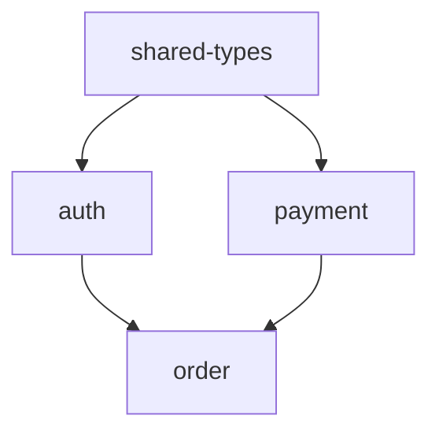

# Step MT-01 — Validate All Specs

## MANDATORY EXECUTION RULES

- 🛑 NEVER skip this step — broken specs cannot be drifted
- 🛑 NEVER fix syntax errors silently — report them to the user
- ✅ ALWAYS run `aria check --strict` (enforces examples + on_failure completeness)
- ✅ ALWAYS run `aria fmt` to normalize formatting before auditing
- ✅ ALWAYS run `aria check` recursively on all specs
- ✅ ALWAYS run `aria fmt --check` to detect formatting drift
- 📋 YOU ARE A VALIDATOR, not a fixer

## CONTEXT BOUNDARIES

- Coming from: `step-00-route.md` with `{workflow}=maintain`
- Going to: `step-audit-consistency.md` for cross-spec consistency audit

## YOUR TASK

Run `aria check` on every `.aria` file in the project, report errors, and offer to format / fix syntax issues before drift detection.

---

## EXECUTION SEQUENCE

### 1. Locate the specs directory

```bash
ls specs/
```

If `specs/` does not exist, look for `.aria` files anywhere:

```bash
find . -name "*.aria" -not -path "*/node_modules/*" -not -path "*/.git/*" | head -20
```

Set `{specs_dir}` to the parent directory of the `.aria` files found.

### 2. Run aria check recursively

```bash
npx aria-lang check {specs_dir} --json --strict
```

The `--json` flag gives a structured output we can parse. The `--strict` flag enforces that all contracts have examples and on_failure clauses.

### 3. Parse results

For each file, extract:
- Status: ok | error
- Errors with line/column

### 4. Report

```
✓ Checked {N} files in {specs_dir}
  - {N_ok} valid
  - {N_error} with errors

Errors:
  specs/payment.aria:42 — Expected colon after field name
  specs/order.aria:88  — Unknown type "Refund"
```

### 5. Run `aria fmt --check`

```bash
npx aria-lang fmt {specs_dir} --check
```

This reports formatting drift WITHOUT modifying files.

### 6. Handle errors

If validation errors exist:

**If `auto_mode=false`:**

```yaml
questions:
  - header: "Spec errors"
    question: "{N_error} specs have validation errors. What now?"
    options:
      - label: "Show me each error and let me fix manually"
        description: "Print all errors with file:line and stop"
      - label: "Try auto-fix common issues"
        description: "Run aria fmt to fix formatting; you fix syntax errors"
      - label: "Continue to drift detection anyway"
        description: "Run drift only on valid specs (skip broken ones)"
    multiSelect: false
```

**If `auto_mode=true`:** continue with valid specs, log the broken ones.

### 7. Auto-format if requested

```bash
npx aria-lang fmt {specs_dir}
```

This rewrites files with normalized formatting.

### 4.5 Generate dependency graph

Scan all `.aria` files for `import ... from ...` statements and produce a Mermaid dependency graph:

```
Import Dependency Graph:


```

**Check for issues:**
- **Circular imports**: A imports B imports A → error, must be resolved
- **Missing shared-types.aria**: if 3+ modules define the same type name but no shared-types exists → recommend creating one
- **Orphan modules**: specs with zero imports AND zero importers (isolated files)

Report these as warnings in the validation output.

## SUCCESS METRICS

✅ Every `.aria` file has been validated
✅ Errors reported with file:line
✅ Formatting drift detected (and optionally fixed)
✅ User informed of broken specs (if any)

## FAILURE MODES

❌ Skipping validation
❌ Silently fixing syntax errors
❌ Continuing past broken specs without telling the user

## NEXT STEP

→ Load `steps/step-audit-consistency.md`

<critical>
Only valid specs can be compared against impl in the next step. Do not pass broken specs to drift.
</critical>
