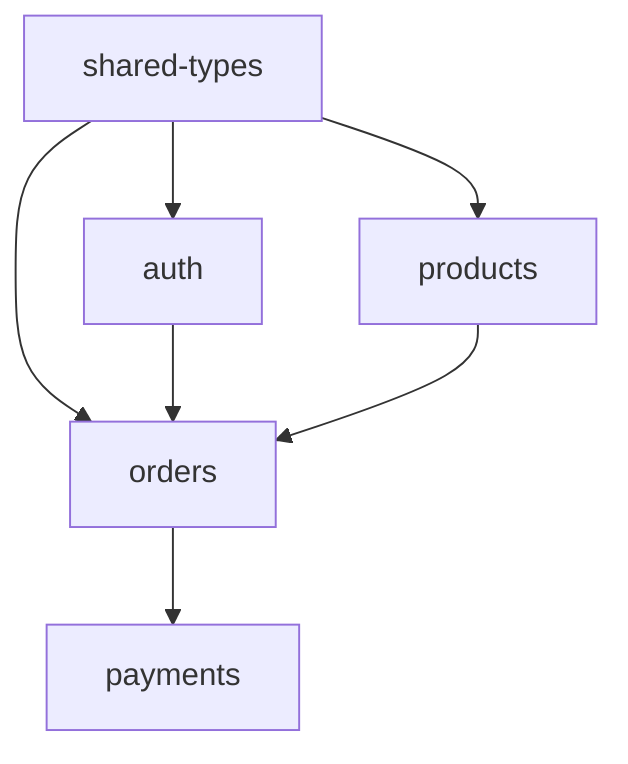

# Step PJ-03 — Generate All Specs

## MANDATORY EXECUTION RULES

- 🛑 NEVER generate specs out of dependency order — foundational first
- 🛑 NEVER skip validation after each spec — `aria check` is mandatory
- 🛑 NEVER batch the writes silently — show progress per module
- ✅ ALWAYS use the standard ARIA syntax (require/ensures/on_failure/examples)
- ✅ ALWAYS include rich type definitions, not just primitives
- ✅ ALWAYS validate each spec with `aria check` before moving to the next
- 📋 YOU ARE A SPEC AUTHOR — write detailed specs, do not implement code
- 🛑 NEVER define a type locally if it's already defined in shared-types.aria or an earlier module — import it
- ✅ ALWAYS generate `shared-types.aria` FIRST, before any domain module
- ✅ ALWAYS run `aria check --strict` (not just `aria check`) after each spec
- ✅ ALWAYS use `aria fmt` after writing each spec

## CONTEXT BOUNDARIES

- Coming from: `step-pj-02-decompose.md` with `{domains}` array set
- Going to: `step-pj-04-iterate.md` with `{generated_specs}` array set

## YOUR TASK

For each module in `{domains}`, write a complete `.aria` file with types, contracts, behaviors, examples — everything needed to capture the module's intent in detail.

---

## EXECUTION SEQUENCE

### 1. Ensure specs/ directory exists

```bash
mkdir -p specs
```

### 1.5 Generate shared-types.aria first

Before generating domain modules, create `{specs_dir}/shared-types.aria` with types that will be shared across 2+ modules:

```aria
module SharedTypes
  version "1.0"
  target {target}

--- Canonical shared types for the {project_name} project.
--- Domain modules import from this file instead of redefining types locally.

-- Shared domain primitives
type UserId is String
  where length(self) > 0
  where length(self) <= 64

type Email is String
  where self matches /^[^@]+@[^@]+\.[^@]+$/
  where length(self) <= 255

type Money is Integer
  where self >= 0

-- Shared enums (used by 2+ modules)
type Status is Enum
  active
  inactive
  pending

-- Shared generic patterns
type Result of T, E is Record
  success: Boolean
  data: T
  error: E

type PaginatedList of T is Record
  items: List of T
  total: Integer
  page: Integer
```

**How to decide what goes in shared-types:**
- Types used by 2+ modules → shared-types.aria
- Types used only by one module → local to that module
- If unsure, keep local — the audit step will catch duplication later

Validate immediately:

```bash
npx aria-lang check {specs_dir}/shared-types.aria --strict
npx aria-lang fmt {specs_dir}/shared-types.aria
```

Add to `{generated_specs}`.

### 2. Generate each spec in dependency order

Loop over `{domains}` (in `order` field). For each domain:

#### a. Decide on the spec content

For the module `{name}`, write a comprehensive `.aria` file that includes:

**Module header — always import shared types:**
```aria
module {DomainName}
  version "1.0"
  target {target}
  import UserId, Email, Money, Status from "./shared-types.aria"
  import User from "./auth.aria"
```

Every domain module MUST import from `shared-types.aria` at minimum. Add imports from earlier domain modules when needed. NEVER redefine a type that exists in shared-types or a prior module.

**Types** — at least 2-4 per module:
- Wrap primitives in domain types (`UserId`, `Money`, `Email`)
- Use refinement (`where self > 0`, `where length(self) > 0`)
- Use enums for status fields
- Use records for entities
- Use generics (`type Result of T, E is Enum`) where it adds value

**Contracts** — at least 1-3 per module:
- Each contract has `inputs`, `requires`, `ensures`, `on_failure`, `examples`
- Use realistic values in `examples` (not `foo`/`bar`)
- Cover happy path AND at least one error case in examples

**Behaviors** (state machines) — when relevant:
- For modules with lifecycle (orders, sessions, posts, etc.)
- Include `states`, `initial`, `transitions`, `forbidden`, `invariants`
- Use temporal assertions when appropriate (`always`, `eventually`, `leads_to`)

**Effects + dependencies** — when relevant:
- `effects sends Email when ...`
- `depends_on EmailService`
- `timeout 30 seconds`
- `rate_limit max 5 per minute per ip`

#### b. Write the spec file

Write to `{specs_dir}/{kebab-domain}.aria`. Use the project's stack target.

#### c. Validate immediately

```bash
npx aria-lang check {specs_dir}/{kebab-domain}.aria --strict
npx aria-lang fmt {specs_dir}/{kebab-domain}.aria
```

If validation fails:
- Show the error
- Edit the file to fix
- Re-validate
- Loop until valid (max 3 attempts, then ask user for help)

#### d. Report progress

```
[1/6] specs/auth.aria — generated (4 types, 4 contracts, 1 behavior) ✓
[2/6] specs/products.aria — generated (3 types, 4 contracts, 1 behavior) ✓
[3/6] specs/orders.aria — generated (3 types, 5 contracts, 1 behavior) ✓
...
```

### 3. After all specs are generated, re-check the whole directory

```bash
npx aria-lang check {specs_dir}/
```

This catches cross-module issues (e.g. a contract references a type from another module that doesn't exist).

If errors occur, fix them and re-check.

### 3.5 Generate dependency graph

Generate a Mermaid diagram showing the import relationships between all specs:

```
Import dependency graph:


```

This helps the user visualize the architecture and spot missing or circular imports.

### 4. Set state

Set `{generated_specs}` = list of generated file paths.

### 5. Final report

```
═══════════════════════════════════════════════
  Spec Generation Complete
═══════════════════════════════════════════════

  Project    : {project_name}
  Specs dir  : {specs_dir}/
  Generated  : {N} files

  Files:
    • specs/auth.aria        (4 types, 4 contracts, 1 behavior)
    • specs/products.aria    (3 types, 4 contracts, 1 behavior)
    • specs/orders.aria      (3 types, 5 contracts, 1 behavior)
    • specs/payments.aria    (4 types, 3 contracts, 1 behavior)
    • specs/commission.aria  (2 types, 1 contract,  0 behaviors)
    • specs/fulfillment.aria (3 types, 3 contracts, 1 behavior)

  Total: 19 types, 20 contracts, 5 behaviors

  All specs validate ✓

═══════════════════════════════════════════════
```

## SUCCESS METRICS

✅ Each domain has a corresponding `.aria` file
✅ Every spec validates with `aria check`
✅ Cross-file imports resolve (no missing types)
✅ Each contract has `requires`, `ensures`, `on_failure`, `examples`
✅ `{generated_specs}` is set
✅ `shared-types.aria` generated first with canonical shared types
✅ Every domain module imports from shared-types (no local redefinitions)
✅ All specs pass `aria check --strict`
✅ Dependency graph shows no circular imports

## FAILURE MODES

❌ Generating specs out of order (a module imports a non-existent module)
❌ Skipping `aria check` after each spec
❌ Writing primitive types instead of domain types
❌ Missing examples or on_failure clauses
❌ Generating implementation code (this step is for SPEC only)
❌ Defining types locally that already exist in shared-types.aria
❌ Generating domain modules before shared-types.aria
❌ Circular imports between domain modules

## NEXT STEP

→ Load `steps/step-pj-04-iterate.md`

<critical>
Quality matters more than speed. A well-detailed spec saves hours of refactoring later.
</critical>
